<p align="center">
  
</p>

<p align="center">
  A self-hosted eSewa payment gateway bridge with <b>dynamic QR code generation</b>, <b>universal Nepali bank support</b>, and <b>automated instant verification</b>.<br>
  <b>Zero-fees and no PAN/VAT required.</b> Accept payments from personal eSewa and all 20+ Nepali commercial banks.
</p>

<p align="center">
  
  
  
  
  
</p>

> ### ⚠️ Legal Disclaimer, Educational & Testing Notice
> This open-source repository is provided **strictly for educational, research, prototype, and developer testing purposes only**. It is an independent proof-of-concept demonstrating email-based receipt parsing via standard IMAP protocols.
> - **Educational & Sandbox Use Only**: This project is intended solely as an educational experiment in automated state synchronization. It should not be used as a replacement for official commercial payment services.
> - **No Affiliation**: This project is completely independent and is **not affiliated, associated, authorized, endorsed by, or in any way officially connected with eSewa Ltd., F1Soft International, or any commercial bank**.
> - **Liability Waiver**: The authors and contributors assume **no liability or responsibility** for any financial transactions, losses, account suspensions, or violations of third-party Terms of Service resulting from the use of this code. Users are solely responsible for ensuring compliance with all local laws and third-party service agreements.
> - **Security**: Always keep your Gmail App Passwords private and never commit your `.env` secrets to public repositories.

---

## Highlights

- **Zero Transaction Fees & No Merchant Registration** — Automate payments using your existing personal eSewa ID without merchant onboarding charges or revenue cuts.
- **Micro-Discount Matching Algorithm** — Dynamically generates unique sub-rupee amounts (e.g. NPR `99.85` for a `100.00` base order) to guarantee collision-free 1:1 transaction matching across simultaneous payers.
- **Dynamic QR Code Generation** — Generates real-time QR codes embedding the exact payment amount, recipient details, and order reference codes.
- **Universal Nepali Bank Support** — Matches payments made from eSewa direct wallet transfers, Mobile Banking Fund Loads (Global IME, NIC Asia, Nabil, NIMB, Sanima, etc.), and Fonepay interoperable QRs.
- **Single-File Backend Architecture** — The entire backend (REST API, WebSockets, IMAP listener, SQLite WAL manager, and webhook dispatcher) is contained in a single standalone file `esewa_gateway.py`.
- **Real-Time Push Synchronization** — Instant UI state updates across WebSockets as soon as eSewa confirms the incoming transaction.
- **Outbound Webhooks with HMAC SHA-256** — Dispatches signed HTTP `POST` notifications to your primary application backend with automated retry logic.
- **Production-Hardened** — Includes SQLite WAL mode, in-memory IP rate limiting, automated background expiry worker, security headers middleware, and password-protected admin console.

---

## Quick Start

Requires **Python 3.10+**.

```bash
# 1. Clone repository
git clone https://github.com/yourusername/esewa-payment-gateway.git
cd esewa-payment-gateway

# 2. Install dependencies
pip install fastapi uvicorn aiosqlite beautifulsoup4 python-dotenv pydantic httpx

# 3. Setup environment variables
cp .env.example .env
# Edit .env and enter your eSewa details and Gmail App Password

# 4. Start the gateway server
python esewa_gateway.py
```

Then open your browser:
- **Checkout Interface**: <http://localhost:8000>
- **Admin Console**: <http://localhost:8000/admin>
- **OpenAPI Interactive Docs**: <http://localhost:8000/docs>

---

## Run with Docker

Deploy with Docker and Docker Compose with non-root security and persistent database volume:

```bash
# 1. Configure environment
cp .env.example .env

# 2. Start containerized gateway
docker compose up -d --build
```

The container automatically persists the SQLite database to the `gateway_data` volume and exposes healthcheck probes.

---

## Configuration

All configuration is managed through environment variables or a `.env` file:

| Variable | Default | Purpose |
|---|---|---|
| `PORT` | `8000` | HTTP port to bind the gateway server. |
| `ADMIN_PASSWORD` | *Required* | Secret password required to access `/admin` and admin API routes. |
| `ESEWA_ID` | *Required* | Your personal eSewa ID or mobile number (encoded in QR payload). |
| `ESEWA_NAME` | *Required* | Your name or business name as displayed on eSewa. |
| `GMAIL_EMAIL` | *Required* | Gmail address linked to your eSewa transaction receipt notifications. |
| `GMAIL_APP_PASSWORD`| *Required* | Google 16-character App Password for IMAP access ([Create here](https://myaccount.google.com/apppasswords)). |
| `ORDER_EXPIRY_MINUTES`| `10` | Lifetime of an active pending order before amount slot reclamation. |
| `DISCOUNT_MIN_OFFSET` | `0.01` | Minimum micro-discount offset in NPR (1 paisa). |
| `DISCOUNT_MAX_OFFSET` | `0.50` | Maximum micro-discount offset in NPR (50 paisa). |
| `WEBHOOK_URL` | *Optional* | HTTP(S) endpoint on your primary app to receive payment webhooks. |
| `WEBHOOK_SECRET` | *Optional* | Shared secret key for generating `X-Signature-SHA256` webhook headers. |
| `DATABASE_PATH` | `./payment_gateway.db` | Local SQLite database file path. |

---

## Dependencies

| Package | Required | Purpose |
|---|---|---|
| `fastapi` | yes | High-performance async REST and WebSocket routing. |
| `uvicorn` | yes | Production ASGI web server. |
| `aiosqlite` | yes | Asynchronous SQLite driver with WAL concurrency support. |
| `beautifulsoup4` | yes | Parsing tabular and HTML email receipt bodies. |
| `python-dotenv` | yes | Secure `.env` environment variable loading. |
| `pydantic` | yes | Strict input schema validation and sanitization. |
| `httpx` | yes | Async HTTP client for outbound webhook delivery. |

---

## API Endpoints

The server provides a clean JSON API and WebSocket interface:

| Method | Endpoint | Description |
|---|---|---|
| `GET` | `/api/banks` | Returns list of supported commercial banks and payment methods |
| `POST` | `/api/orders` | Create a new payment order with a unique fractional amount and QR |
| `GET` | `/api/orders/{id}` | Fetch current order status, timestamps, and matched reference |
| `POST` | `/api/orders/{id}/claim` | Fallback resolution: claim payment by ref code or round amount |
| `GET` | `/api/health` | Service health, IMAP listener status, and config validation |
| `POST` | `/api/admin/login` | Authenticate admin console with `ADMIN_PASSWORD` |
| `GET` | `/api/admin/orders` | Protected: List recent orders (Requires `X-Admin-Password`) |
| `GET` | `/api/admin/transactions` | Protected: List parsed receipts (Requires `X-Admin-Password`) |
| `WS` | `/ws/orders/{id}` | Real-time WebSocket connection for instant payment updates |

### Create Order Example

```bash
curl -X POST "http://localhost:8000/api/orders" \
  -H "Content-Type: application/json" \
  -d '{
    "base_amount": 100.0,
    "bank_name": "Global IME Bank",
    "customer_name": "John Doe",
    "item_description": "Pro Subscription"
  }'
```

Response:
```json
{
  "success": true,
  "order": {
    "id": "ORD-7175154C",
    "base_amount": 100.0,
    "target_amount": 99.85,
    "discount_amount": 0.15,
    "bank_name": "Global IME Bank",
    "status": "PENDING",
    "expires_at": "2026-08-24T14:30:00Z",
    "qr_payload": "{\"eSewa_id\": \"your_id@esewa\", \"name\": \"Your Name\", \"amount\": 99.85, \"remarks\": \"ORD-7175154C\"}",
    "expires_in_seconds": 600
  }
}
```

---

## Supported Banks & Sources

All major Nepali banking channels and wallet methods are recognized and normalized:

| Channel | Supported Institutions |
|---|---|
| **Direct Wallet** | eSewa Wallet Direct Transfer, eSewa Web Checkout |
| **Class-A Commercial Banks** | Global IME Bank, NIC Asia Bank, Nabil Bank, Sanima Bank, Prabhu Bank, Himalayan Bank, Everest Bank, Kumari Bank, NIMB Bank, Prime Bank, Laxmi Sunrise Bank, Machhapuchchhre Bank, Citizens Bank, Siddhartha Bank, Standard Chartered Bank, ADBL, Nepal Bank, RBB |
| **Interoperable Network** | Fonepay QR, ConnectIPS Mobile Banking load receipts |

---

## Outbound Webhooks (HMAC SHA-256)

When an order transitions to `PAID`, the gateway immediately dispatches an HTTP `POST` request to your `WEBHOOK_URL`.

### Webhook Payload
```json
{
  "event": "payment.success",
  "order_id": "ORD-7175154C",
  "status": "PAID",
  "amount": 99.85,
  "ref_code": "1PD96BE",
  "bank_name": "Global IME Bank",
  "timestamp": "2026-08-24T14:20:30Z"
}
```

### Signature Verification
The request includes the header `X-Signature-SHA256: <hex_digest>`. You can verify it in your application backend:

```python
import hmac, hashlib

def verify_webhook(raw_body: bytes, received_signature: str, secret: str) -> bool:
    expected_signature = hmac.new(secret.encode(), raw_body, hashlib.sha256).hexdigest()
    return hmac.compare_digest(expected_signature, received_signature)
```

---

## Python Drop-In Integration

`esewa_gateway.py` can also be embedded directly into existing FastAPI apps in 3 lines:

```python
from fastapi import FastAPI
from esewa_gateway import EsewaGateway

app = FastAPI()
gateway = EsewaGateway()

@gateway.on_payment_success
async def on_paid(order_id: str, amount: float, ref_code: str, bank_name: str):
    # Fulfill purchase, credit wallet, activate license, etc.
    print(f"Order {order_id} verified with Ref {ref_code} for NPR {amount}")

app.include_router(gateway.router, prefix="/api/esewa")
```

---

## Architecture

```
+-------------------------------------------------------------+
|                        Customer UI                          |
|         - Selects Bank & Enters Base Amount (100 NPR)       |
|         - Renders Dynamic QR + Micro-Discount Target        |
|         - WebSocket Listens for Real-Time Confirmation      |
+------------------------------+------------------------------+
                               |
                               | (Scans QR & Pays NPR 99.85)
                               v
+-------------------------------------------------------------+
|                 eSewa & Bank Payment Network                |
|         - Customer executes Fund Load / Wallet Transfer     |
|         - eSewa sends automated confirmation email          |
+------------------------------+------------------------------+
                               |
                               | (Incoming Email Receipt)
                               v
+-------------------------------------------------------------+
|             eSewa Automated Bridge (esewa_gateway.py)       |
|         - IMAP Listener parses Ref Code & Amount (99.85)    |
|         - Matches with active PENDING order in SQLite       |
|         - Updates Order Status to PAID in WAL Database      |
|         - Broadcasts WebSocket event to Client              |
|         - Dispatches HMAC SHA-256 signed Outbound Webhook   |
+-------------------------------------------------------------+
```

---

## Contributing

Contributions are welcome! If you would like to contribute parser improvements, bank mappings, or features:
1. Fork the repository
2. Create your feature branch (`git checkout -b feature/new-bank`)
3. Commit your changes (`git commit -m 'Add support for new payment template'`)
4. Push to the branch (`git push origin feature/new-bank`)
5. Open a Pull Request

---

## License

Released under the [MIT License](LICENSE).

---

## Acknowledgements

Special thanks to the open-source community for making autonomous, developer-friendly payment tools possible in Nepal.

<div align="center">

**Made with ❤️ for the Nepal Developer & Open Source Community**

[⬆ Back to top](#)

</div>
